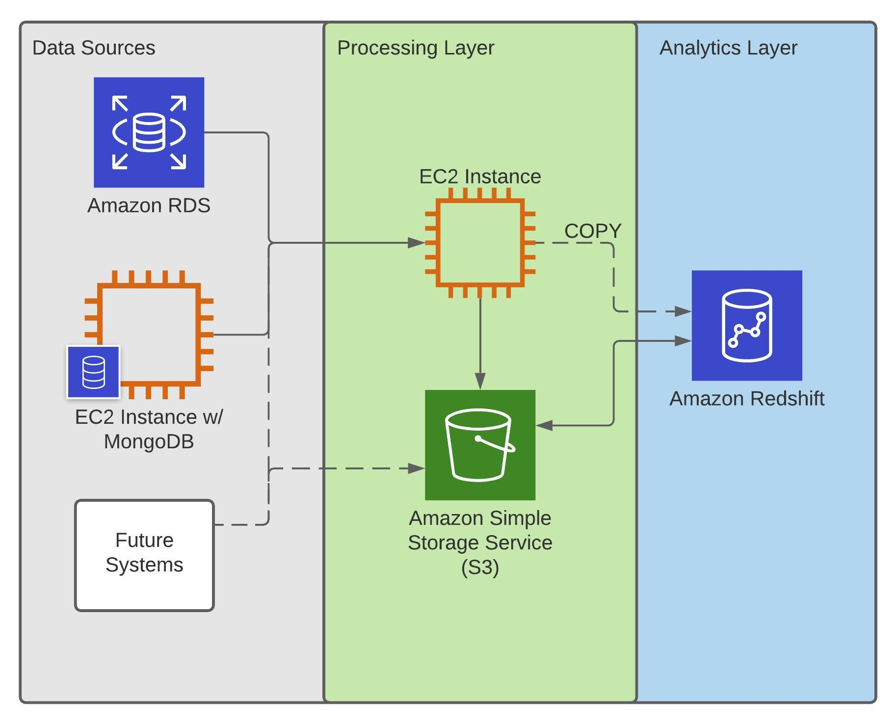
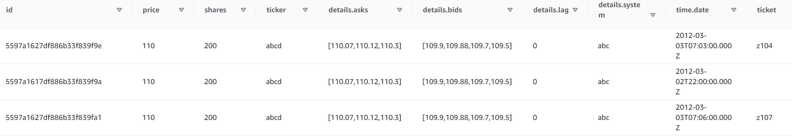
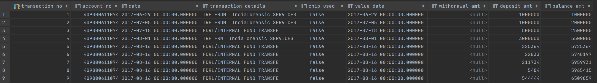

## Stori Tech Challenge

### Description:
For this challenge, you are tasked with creating a simple data pipeline to copy data from various data sources to a data warehouse. The pipeline should run on a schedule and copy over data that has been either inserted or updated in the data sources since the last pipeline run.
The data warehouse should consist of a small Redshift cluster (you can use a dc2.large for .25c/hr and shut it down when not using it). Both a SQL database and a NoSQL database should be used as data sources. You can choose whichever databases you'd like for these; but you must import the data we've provided.
The guidelines for the pipeline itself are intentionally open-ended and the pipeline can be implemented using whichever tools you choose. We just ask that you use AWS as a cloud provider for any cloud services you leverage. Once you are finished building the pipeline, please commit all code and relevant files to GitHub.

### Data:
* txns.csv contains fake bank transactions to be imported and used in the SQL database.
* trades.json contains fake trading data to be used in a NoSQL database.

### Constraints:
* Must use AWS as the cloud provider for any cloud services.
* Must use Redshift as the data warehouse.
* Must use the datasets that we provide. You can add additional data to them if you'd like and/or use additional datasets to demonstrate your pipeline.

### Installation:

To install any required dependencies, use:

`pip install -r requirements.txt`

* Note that python `3.8+` is required
* PostgreSQL `12` is recommended
* MongoDB `4.4.5` is recommended

### Usage:

* The pipeline is configured to run based on cron jobs every 20 minutes: `*/20 * * * *` OR `00,20,40 * * * *`
* Any data that is added or updated to the source Postgres database will automatically be copied into Redshift on the next cycle
* The MongoDB connection is currently configured to pull a single .json document from the DB and upload it to the data warehouse. Adding additional .jsons will not break the pipeline but they will not upsert in the correct order. Subsequent versions of the pipeline would pull the most recent documents based on either a datetime stamp or queue.
* The system is currently configured to do upserts only. It will delete records from Redshift, but this needs to be uncommented in the upsert statement.

### Architecture:

Generally, the platform's architecture is as follows:
* etl_workflow.py is the primary execution script
* Data sources are ingested from an AWS RDS-hosted PostgreSQL instance and a MongoDB on an EC2 instance in batches via the EC2 instance in the processing layer
* After the data has been extracted and transformed, it is staged into an S3 bucket
* The same EC2 instance then runs a copy command from Redshift which pulls in all data staged in S3. This is done to make use of Redshift's massively parallel processing ability.

### Database Schemas:

### Other:
* A auto-increment/serial column was added to the Postgres DB to serve as a primary key. This is the basis for upserts in Redshift.
* Column names for the Postgres DB were cleaned.
* The .json data is normalized within the pipeline.
* I made an assumption that the balance_amt column in the postgresdb would be pre-calculated during insertion into postgres.
